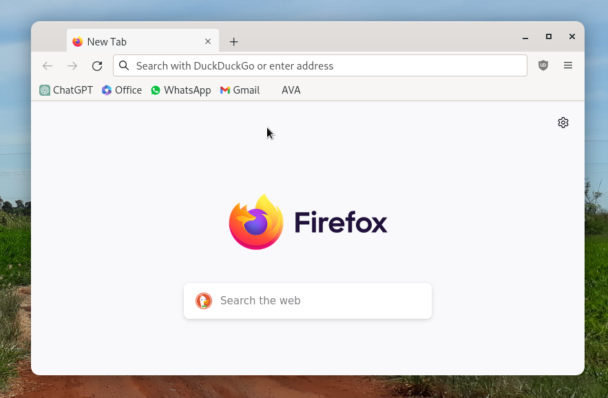

# System setup manual

## Desktop environment

The distro I'm using right now is Debian Testing, with the GNOME Shell.

## Scripts

_(none yet)_

## Programs

- Firefox
- [onedriver](https://github.com/jstaf/onedriver): An OneDrive client for Linux
- yt-dlp:
  ```sh
  sudo apt install ffmpeg python3-pip
  pip3 install yt-dlp
  ```
- [Xournal++](https://xournalpp.github.io/): a great note-taking app with support for my drawing tablet

## Program settings

### onedriver

Create a mountpoint at `/mnt/onedrive`. Then, change its permissions so that you become the owner of the directory.

```sh
sudo mkdir -p /mnt/onedrive
sudo chown lucas:lucas /mnt/onedrive
```

With that out of the way, open onedriver and login to your account. Select the previously created directory when prompted.

Make sure to enable automounting the drive via the GUI.

### KeepassXC

Firstly, install KeepassXC.

The password vault is stored at my [OneDrive](#onedriver) at the directory `/mnt/onedrive/Passwords.kdbx`.

### Firefox

For each installation I do, I always install these extensions.

#### Extensions

- uBlock Origin
- Old Reddit Redirect

#### Custom theme

Even though a custom theme is not strictly necessary for the setup, it kinda looks nice. So here it is:



This theme gives Firefox a Microsoft Edge-like appearance.

First, enable custom stylesheets by going to `about:config` and setting `toolkit.legacyUserProfileCustomizations.stylesheets` to `true`.

After that, copy (or create a symbolic link) the folder `(repository)/FirefoxProfileDirectory/chrome` to `~/.mozilla/firefox/(profile directory)`. Then restart Firefox.
